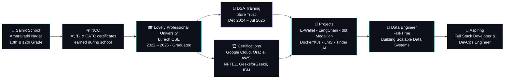

<!-- hero: monochrome ASCII portrait (types in) beside the extruded 3D ASCII
     wordmark (wipes in left-to-right, then rocks on its vertical axis).
     portrait: python scripts/make_ascii_svg.py   (edit assets/photo.jpg first)
     wordmark: python scripts/make_wordmark_svg.py
     how the wordmark is built: docs/3d-ascii-wordmark.md
     NOTE: if these SVGs render with washed-out contrast, open the script and
     swap the stroke/fill color to #2DD4E8 (cyan) or #B3A1FB (light violet) —
     the original #6C63FF is too dark against the #0D1117 background to read
     cleanly at small sizes. -->

<h3><code>tharani@github ~ $ whoami</code></h3>

<table>
<tr>
<td valign="top"></td>
<td valign="top"></td>
</tr>
</table>

 

 
 

<!-- real contribution graph, regenerated daily by .github/workflows/update-heatmap.yml
     using scripts/generate_contribution_svg.py — dark grey for no activity,
     a blue gradient for activity, no third-party neon styling -->

<h3><code>tharani@github ~ $ ./snake.sh</code></h3>

 
 

<h3><code>tharani@github ~ $ ./links.sh</code></h3>

<b>Data Engineer · Aspiring Full Stack Developer · Aspiring DevOps Engineer</b>

 

---

## 👋 About Me

I'm **Tharani Dharan Saravanan** — a **Data Engineer**, and an **aspiring Full Stack Developer & DevOps Engineer**.

I graduated with a **B.Tech in Computer Science and Engineering** from Lovely Professional University in 2026. I now work full-time as a **Data Engineer**, building scalable, cloud-native data pipelines and architectures — and alongside that, I keep sharpening my full-stack and DevOps skills through hands-on side projects spanning React front-ends, Spring Boot microservices, Docker/Kubernetes deployments, and infrastructure-as-code.

- 🔭 Currently working full-time as a **Data Engineer**, building scalable data systems across cloud warehouses
- 🌱 Actively growing into **full-stack development** and **DevOps/cloud infrastructure**
- 🎯 Aspiring to be a well-rounded engineer who moves fluently across data, application, and infra layers
- 💬 Ask me about **Java, Spring Boot, React, LangChain, dbt, or cloud data pipelines**
- ⚡ Fun fact: I balance debugging sessions with **basketball and badminton**

---

## 🧭 My Journey So Far

---

## 🛠 Tech Stack

**Languages & Core Web**

  

**Frameworks & Libraries**

  

**Databases**

  

**Data Engineering & Cloud Warehousing**

**DevOps & Cloud Infrastructure**

  

**AI / LLM Tooling**

**Other Tools**

  

---

## 💼 Current Role

> 🟢 **Data Engineer** · *Full-Time · 2026 – Present*
> Designing and building scalable, cloud-native data architectures — optimizing schemas across **BigQuery** and **Snowflake**, building fault-tolerant ETL pipelines with **Apache Airflow**, and applying efficient data structures to improve partitioning, clustering, and staging strategies for downstream analytics.

---

## 🚀 Featured Projects

### 💸 E-Wallet Microservices System
`Spring Boot` `MySQL` `Kafka` `Gradle-Kotlin`
- Spearheaded a microservices-based e-wallet platform with real-time transaction notifications powered by Apache Kafka.
- Built four modular services: `UserService`, `WalletService`, `TransactionService`, and `NotificationService`.
- Delivered a scalable, high-availability architecture designed for easy future expansion.
- 🔗 [View Repo](https://github.com/TharaniDharan10/E_Wallet)

### 🦜 LangChain LLM & RAG Learning Project
`LangChain` `Google Gemini` `Chroma` `RAG` `Agents`
- Built a chapter-by-chapter GenAI project covering LLM fundamentals, embeddings, and a full **RAG pipeline** (chunking → embeddings → Chroma vector DB → semantic retrieval).
- Implemented **ReAct tool-using agents** (DuckDuckGo, Wikipedia, Arxiv) with structured output and conversational memory.
- 🔗 [View Repo](https://github.com/TharaniDharan10/Langchain_Demo)

### 🧊 dbt + Databricks Medallion Pipeline
`dbt-core` `Databricks` `Snowflake/BigQuery-style Warehousing` `uv`
- Built an end-to-end **Bronze → Silver → Gold** medallion pipeline on Databricks, orchestrated with dbt.
- Modeled raw sources into cleaned Silver layers and business-ready Gold tables, using **SCD Type 2 snapshots** to preserve historical change tracking.
- Set up a **dev → prod promotion workflow** with environment-aware Jinja targets, plus generic and singular data tests for pipeline reliability.
- 🔗 [View Repo](https://github.com/TharaniDharan10/DBT_Core_Demo)

### 🐳 Docker + Kubernetes + Terraform CI/CD Pipeline
`Spring Boot` `Docker` `Kubernetes (EKS)` `Terraform` `GitHub Actions`
- Containerized a Spring Boot REST API and deployed it to **AWS EKS** through a fully automated CI/CD pipeline.
- Provisioned VPC, EKS cluster, and managed node groups entirely as **Infrastructure-as-Code** with Terraform.
- Pipeline flow: build → containerize → provision infra → deploy → expose via Load Balancer, with support for rolling updates and scaling via `kubectl`.
- 🔗 [View Repo](https://github.com/TharaniDharan10/Docker_Demo)

### 📚 Spring Boot Library Management System
`Spring Boot` `MySQL` `Redis` `Maven`
- Engineered a monolithic LMS supporting registration, book borrowing, returns, and fine collection.
- Used Spring Data JPA for persistence, Redis for caching, and Spring Security for authentication.
- Optimized database queries and boosted performance through strategic caching.
- 🔗 [View Repo](https://github.com/TharaniDharan10/Library_Management_System)

### ❤️‍🔥 Tinder AI Chat App
`Spring Boot` `MongoDB` `Llama` `React` `Maven`
- Built an AI-powered, Tinder-style dating app with gender-specific Llama AI personas for intelligent conversations.
- React front-end for fluid swiping/chat UX, Spring Boot backend, and MongoDB for profile/match/chat data.
- Delivered real-time chat and swipe mechanics with optimized, scalable performance.
- 🔗 [View Repo](https://github.com/TharaniDharan10/Tinder_AI)

---

## 📘 Training

**Sure Trust** — *Data Structures & Algorithms Intern* | Dec 2024 – Jul 2025
- Built in-depth DSA proficiency through structured, hands-on problem-solving.
- Applied algorithmic thinking to optimize solutions and improve coding efficiency.

---

## 🏅 Certifications

| Certification | Issuer | Date |
|---|---|---|
| [Associate Cloud Engineer](https://www.credly.com/badges/726451e3-b9eb-48ac-97bf-446e043ecf01/public_url) | Google Cloud | Apr 2026 |
| [Cloud Infrastructure 2025 Certified Developer Professional](https://brm-certview.oracle.com/ords/certview/ecertificate?ssn=OC7481308&trackId=OCID25CP&key=ff59eff54daffe360c0186bd381876a77a254f69) | Oracle | Oct 2025 |
| [Cloud Infrastructure 2025 Certified Architect Associate](https://brm-certview.oracle.com/ords/certview/ecertificate?ssn=OC7481308&trackId=OCI25CAA&key=3a31d00698bff399606916ce21aa83a81b55afb6) | Oracle | Oct 2025 |
| [Solutions Architecture](https://forage-uploads-prod.s3.amazonaws.com/completion-certificates/pmnMSL4QiQ9JCgE3W/kkE9HyeNcw6rwCRGw_pmnMSL4QiQ9JCgE3W_YnBgYoNpEf5iKbis9_1753196575165_completion_certificate.pdf) | AWS (Forage) | Jul 2025 |
| Cloud Computing | NPTEL | Oct 2024 |
| [Java Backend Development](https://media.geeksforgeeks.org/courses/certificates/992b47ab5d286be6ef84e95ffe22f787.pdf) | GeeksforGeeks | Sep 2024 |
| [Agile Job Simulation](https://forage-uploads-prod.s3.amazonaws.com/completion-certificates/J.P.%20Morgan/5QiaMtZ4k8ngYKn4D_JPMorgan%20Chase%20%26%20Co._YnBgYoNpEf5iKbis9_1724096434962_completion_certificate.pdf) | JPMorgan Chase & Co (Forage) | Aug 2024 |
| [Introduction to Web Development](https://www.coursera.org/account/accomplishments/verify/ANCVJT8ADNVK) | IBM | Apr 2024 |

---

## 🏅 References

| Name | Role | Location | Email |
|---|---|---|---|
| **Kamalakannan Rajagopal Manigandan** | Assistant Vice President, Citi | Chennai, Tamil Nadu, India | Kamalakannan.R.M@outlook.com |
| **Lalit Kumar R M** | Associate, J P Morgan | Mumbai, Maharashtra, India | LalitKumar.RM@outlook.com |

---

## 💡 Beyond Code

| | | |
|---|---|---|
| **⚔ NCC** | **🏀 Sports** | **🌍 Languages** |
| Earned 'A', 'B' and CATC certificates; leadership camps building discipline and teamwork | Regular Basketball & Badminton player, balancing fitness with academics | 🇮🇳 Tamil (Native) · 🇬🇧 English (Fluent) · 🇮🇳 Hindi (Fluent) |

---

## 📊 GitHub Stats

  
  

  

  

---

## 💬 Let's Build Something Great

Whether it's data pipelines, full-stack apps, or cloud infrastructure — I'm always up for an interesting conversation or collaboration.

  

*Open to full-stack, backend, and data engineering opportunities & collaborations!* 🚀

